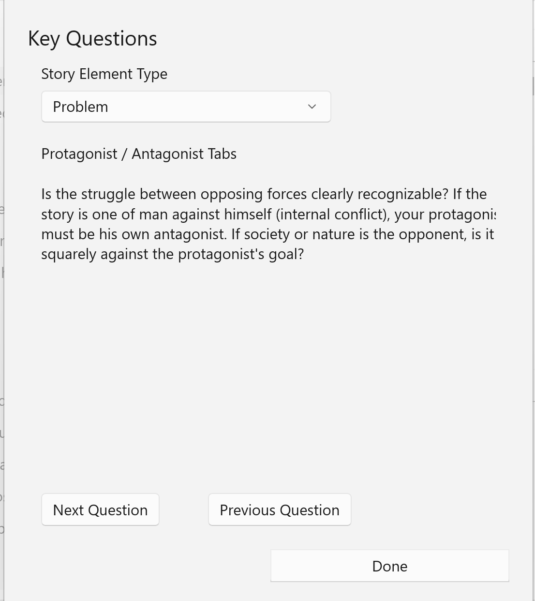

### Conflict Builder ###
Conflict Builder

This 

While we often think we’d like to live our lives with a minimum of conflict, we’re fascinated by the stuff, and our fiction absolutely depends on it.  

Conflict is easy to define: it’s what prevents your character from achieving his or her goal. Picking the right conflict is arguably the most important decision you’ll make in designing your story. If there’s no struggle, there’s no story. Robert McKee puts it this way: Nothing moves forward in a story except through conflict.

Not all conflict will suit your needs. It’s easy to swing towards either of two directions.  At the one extreme is senseless violence, with Black Bart villains and a need for your hero to wear tights and a cape. At the other lies the absence of meaningful conflict, replaced with shallow conflicts which are easily resolved and lead to Pollyanna outcomes.  The right conflict adds complexity and layers of meaning to your story. 

There are endless forms of conflict, but fortunately, there is a literature and practice that applies some order to it all: Conflict Resolution Theory. CR Theory has developed from third-party work on conflict resolution as practiced by mediators and legal authorities. These efforts are attempts to find peaceful resolutions to disputes. This is emphatically not  your aim as a fiction writer, you want to build conflict, but CR Theory does provide a useful framework to examine conflict.

Conflict Categories
CR Theory generally classifies a conflict according to the five categories below -- relationship, data, interest, structural and value. Each has its own subcategories and, typically, examples of a conflict.
Relationship Conflicts
Relationship conflicts occur because of negative behavior patterns by or both parties,  strong negative emotions, misconceptions and stereotypes, and poor (or no) communication. They frequently involve pressure from other non-relationship issues (such as money) or third-parties. Relationship problems often follow a downward spiral of destructive actions. 
Data Conflicts
Data conflicts occur when people lack the information necessary to make good choices, are accidentally or intentionally misinformed, disagree on what data is important or how the data They frequently involve poor communication between the adversaries.
Interest Conflicts
Interest conflicts are caused by competition over perceived incompatible needs. Conflicts of interest result when one or more of the parties believe that in order to satisfy his or her needs, the needs and interests of an opponent must be sacrificed- that a zero-sum game is being played. Interest-based conflict will commonly be expressed as power struggles and rank pulling. Interest conflicts may occur over substantive issues (such as money, physical resources, time, property crimes, etc.); procedural issues (the way the dispute is to be resolved); and psychological issues (assault and crimes of person, dominance, perceptions of trust, fairness, desire for participation, respect, etc.)
Structural Conflicts
Structural conflicts are caused by forces external to the people in dispute. Limited physical resources or authority, geographic constraints (distance or proximity), time (too little or too much), organizational changes, and so forth can make structural conflict seem like a crisis. One possible outcome of a structural conflict- rare in fiction- is cooperation or a structural change. 
Value Conflicts
Value conflicts are caused by perceived or actual incompatible belief systems. Values are beliefs that people use to give meaning to their lives. People frequently coach values in terms of right and wrong. Value disputes arise when people attempt to force one set of values on others or lay claim to exclusive value systems that do not allow for divergent beliefs. Value conflicts are generally intractable.
SubCategories
Each of these five categories can be further divided into subcategories.
Relationship Conflicts differ according the the type of relationship. 
Data Conflicts differ according the type of information mismatch between the two parties.
Interest Conflicts
Where crime fits:

In General:
Antisocial Behavior (SOCIAL PSYCHOLOGY) iResearchNet 
Sociopathy
Antisocial personality disorder - Symptoms and causes - Mayo Clinic 
Antisocial Personality Disorder (Sociopathy): Causes and Symptoms (psycom.net) 

Psychopathy

Conflict Theory in Criminal Justice (legalbeagle.com) 
Common conflicts in Criminal Justice Organizations - Common Law Essays, Criminal justice, Criminal Law Essays, Justice (lawaspect.com) 
Crime and Conflict Theory -- Attack the System 
Strengths and Weaknesses of Conflict Theory (synonym.com) 
Sociological/Criminological Theorising -- Deviance and Social Control - Law Essays (lawaspect.com) 
Crime and conflict - GSDRC 
Structural Sources of Conflict (eolss.net) 
The 8 causes of conflict (and what to do about them) | by Duane Rohrbacher | Medium 
The Relevance of Clausewitz's Theory of War to Contemporary Conflict Resolution (jstor.org) 

Take a look at this last one (‘8 causes’) against the categories I have. For example, ‘Policy’ may automatically point to structural issues.

Clausewitz describes war as “...a clash between major interests, which is resolved by bloodshed -- that is the only way in which it differs from other conflicts.” 

The issue of information warfare

When it comes to an extremely important point, the morality of war, Clausewitz says: “the moral factor is the most fluid element of all, and therefore spreads most easily to affect everything else.” 9 

warfare is “Trinitarian.” Simply put, it is about people, armed forces, and government.12 

These dynamics are also part of a new strategic landscape of conflict. Traditionally, violent conflict has been associated with inter-state wars or civil wars, but there is increasing agreement among conflict analysts that most current violent conflicts do not fit these ‘traditional’ categories. For instance, most violent deaths occur in non-traditional conflict settings. The new landscape of conflict frequently I’nvolves a mix of ingredients such as local and cross-border organised crime, socio-economic exclusion, rapid urbanisation, political change after years of stasis, or long-standing disputes over land or identity. 

Something for Everyone in the Military-Industrial Complex | War Is Boring 
This is another rabbit hole. But a very interesting one. 
‘It turns out that all the advising and assisting, all the training and coaching, has only made matters worse. As for those overstretched forces, relentless deployments are evidently breaking them down as reports indicate that rates of mental distress and suicide are again on the rise among them. 


